# kill_the_werewolf
##Deception Game

 This will be based off Mafia. Basically there is a werewolf and other characters. The characters need to figure out who the werewolf is. Some characters will have special abilities. 

 TODO: Elaborate... 

## Architecture
I guess this can be a isomorphic app, client side for everything except the actually game itself, but I guess redux ajax can handle the client side as well... I don't know but let's get started.
### Express Backend
* ^Socket server will be in backend with WS library
### Create-React-App Frontend
* ^React Router for routing

##Wireframes
###Home Page
 
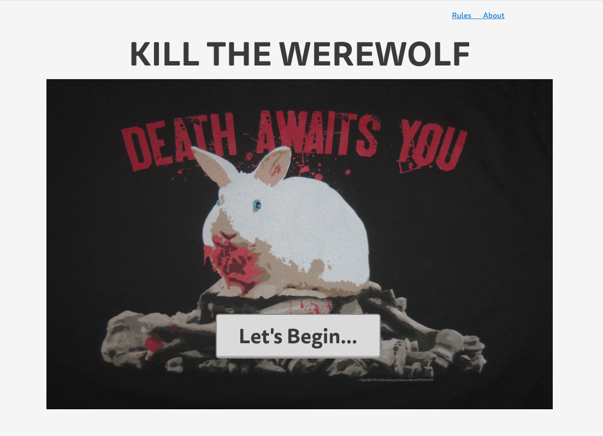

### Choose Amount of Players and Discussion Time
 
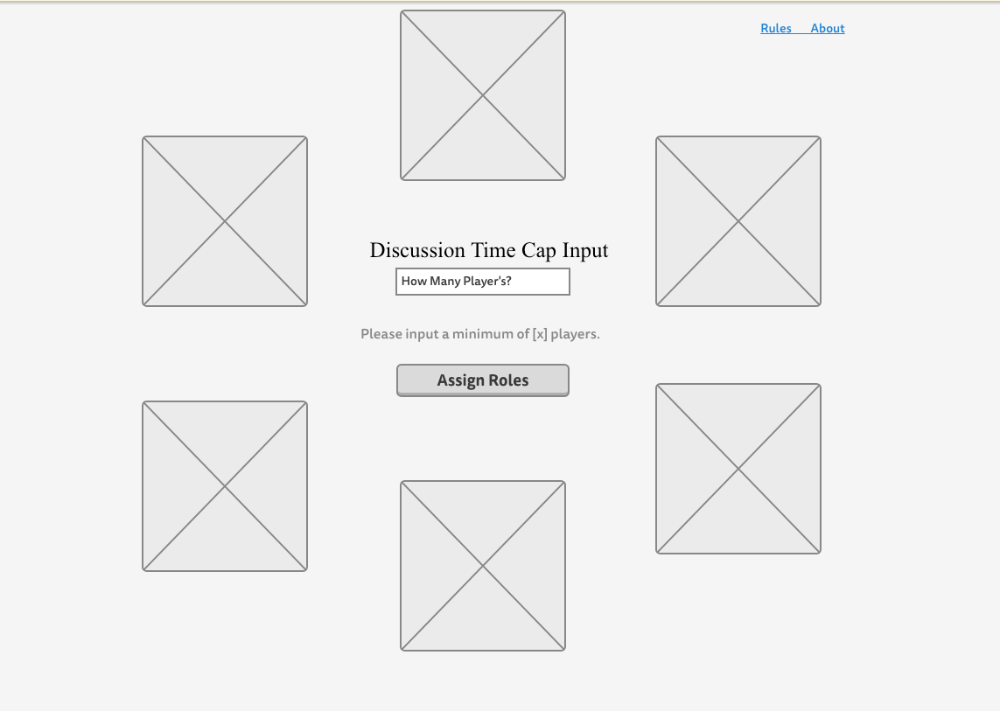

### Website Wireframe for Recieving Roles
 

### Mobile Wireframe for Recieving Roles
 
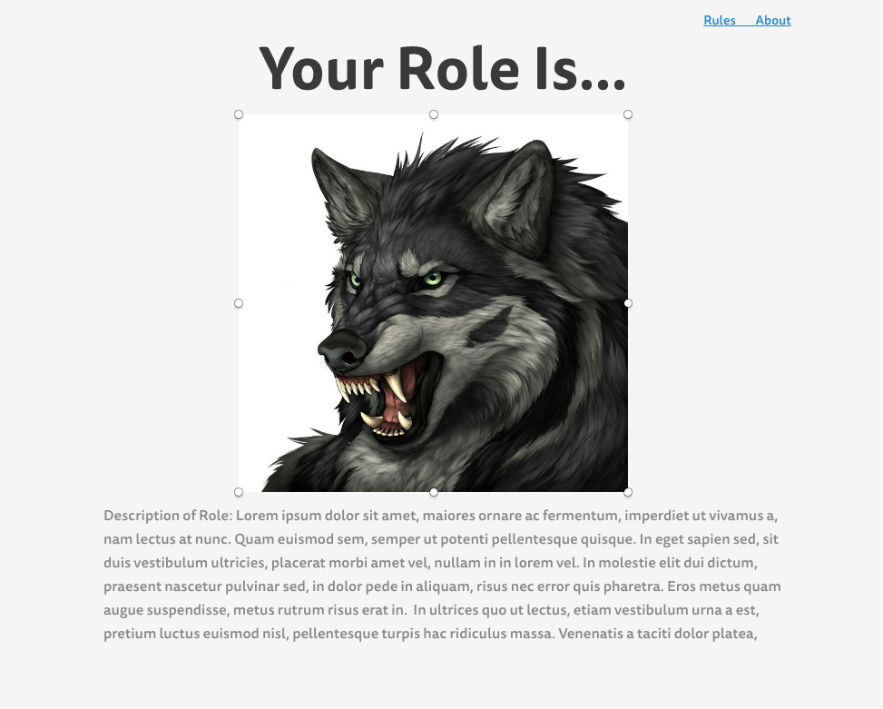

### Day Time
 
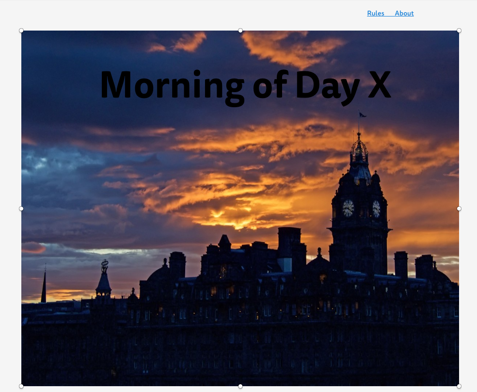

### Who Died?
 
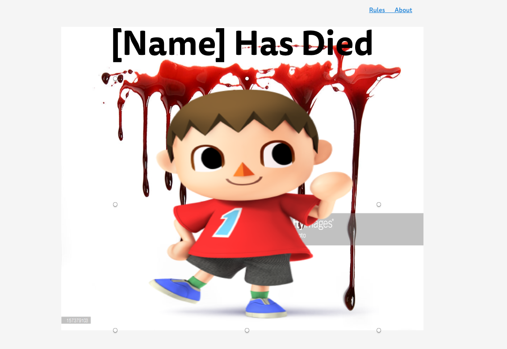

### Group Discussion
 
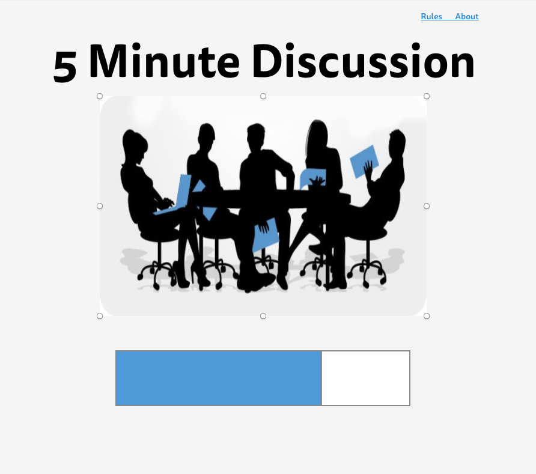

### Night Time
 
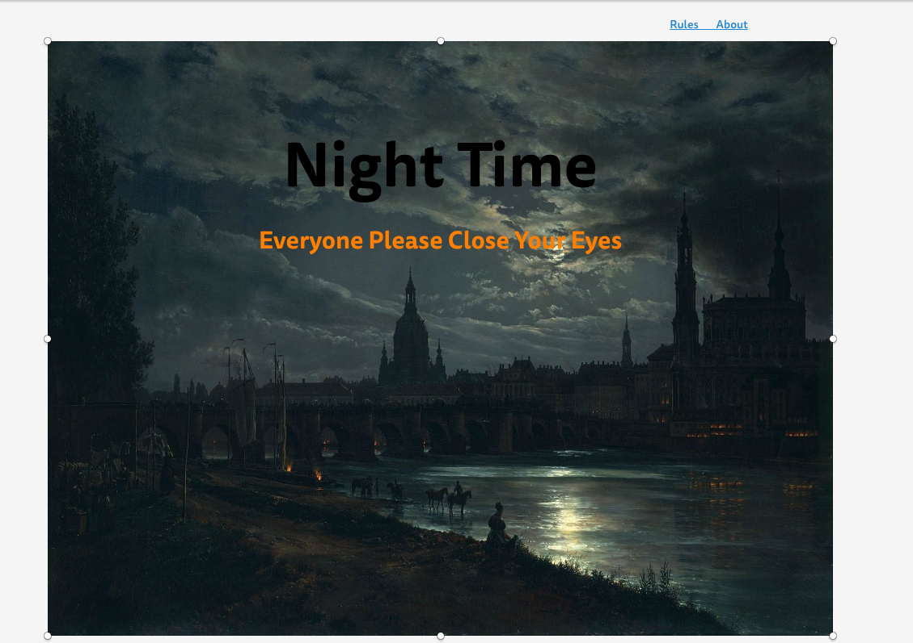

### Website Werewolves Choose Who to Eat
 
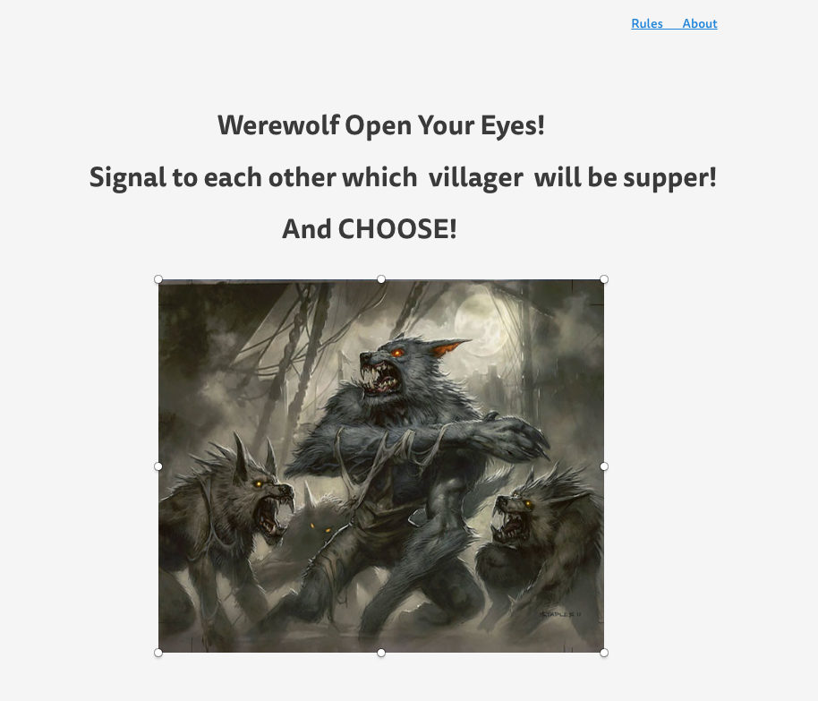

### Mobile Werewolves Choose Who to Eat
 
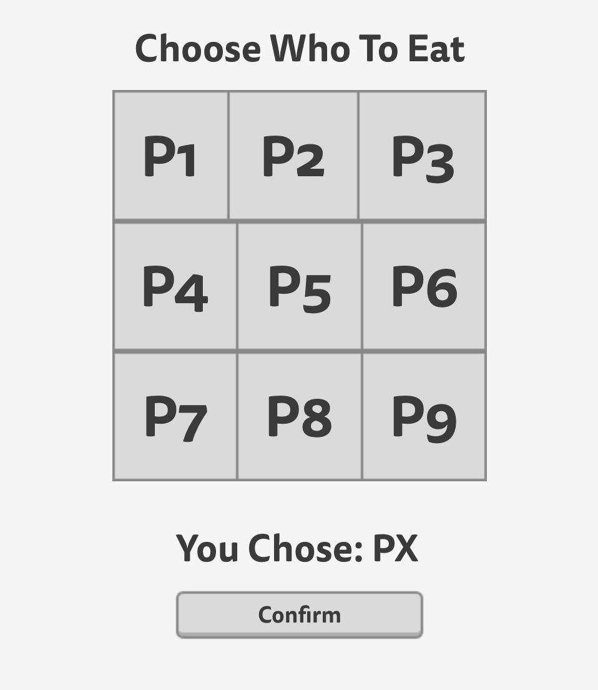

### Results
 
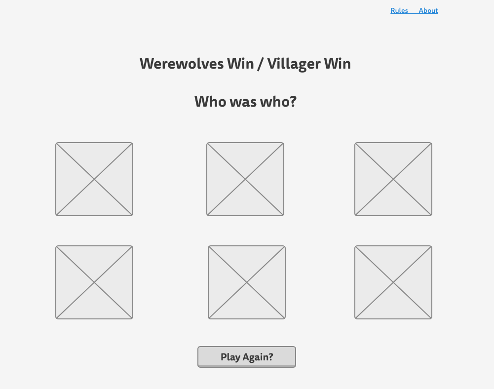

### Rules Page
 
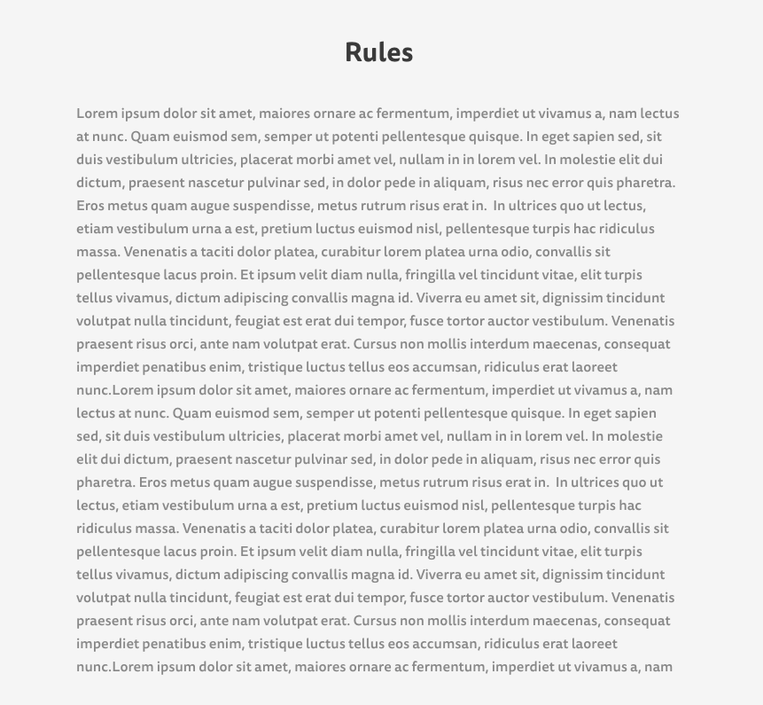

### About Page
 
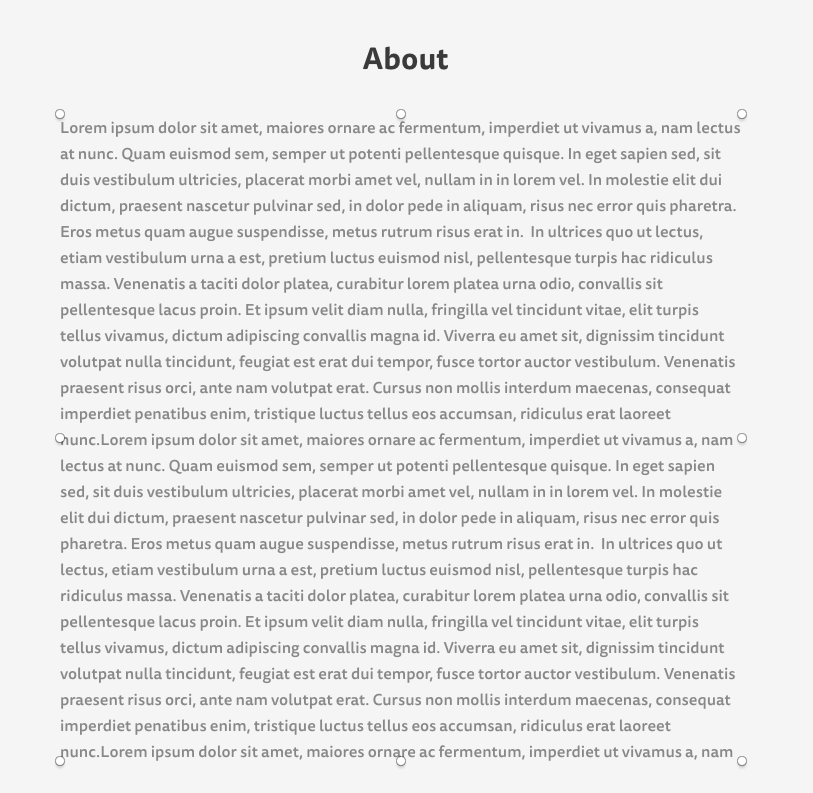

